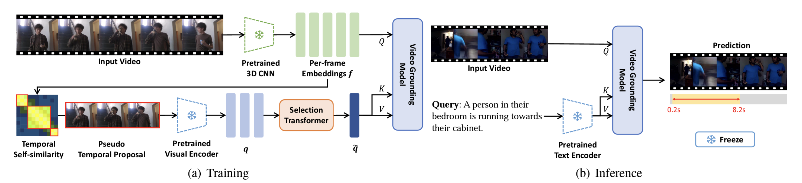

# Language-free Training for Zero-shot Video Grounding 

This is an unofficial reproduce repository for [Language-free Training for Zero-shot Video Grounding](https://arxiv.org/abs/2210.12977). (WACV 2023)


Given an untrimmed video and a language query depicting a specific temporal moment in the video, video grounding aims to localize the time interval by understanding the text and video simultaneously. One of the most challenging issues is an extremely time- and cost-consuming annotation collection, including video captions in a natural language form and their corresponding temporal regions. In this paper, we present a simple yet novel training framework for video grounding in the zero-shot setting, which learns a network with only video data without any annotation. Inspired by the recent language-free paradigm, i.e. training without language data, we train the network without compelling the generation of fake (pseudo) text queries into a natural language form. Specifically, we propose a method for learning a video grounding model by selecting a temporal interval as a hypothetical correct answer and considering the visual feature selected by our method in the interval as a language feature, with the help of the well-aligned visual-language space of CLIP. Extensive experiments demonstrate the prominence of our language-free training framework, outperforming the existing zero-shot video grounding method and even several weakly-supervised approaches with large margins on two standard datasets.




---
## Environment

### Get the code
- Clone this repo with git, please use:
```bash
git clone https://github.com/aniki-ly/Language-free-training-for-zero-shot-video-grounding.git
```

### Requirements and Installation
We recommended the following dependencies.

- CUDA >= 11.0
- Python 3.7
- torch 1.7.1
- torchvision 0.8.2
- torchtext
- numpy
- easydict
- terminaltables
- yacs
- h5py
- tqdm
- wandb

#### Working environment
- Nvidia V100 (32G)
- Ubuntu 18.04.5
- pytorch 1.6.1

## Download

### Dataset

- This [link](https://drive.google.com/file/d/1Vjgm2XA3TYcc4h9IWR5k5efU-bXNir5f/view?usp=sharing) is connected for downloading video features used in this paper. </br>
: After downloading the video feature, you need to set the `data path` in a config file. </br> 


## Performance

**1. Charades Dataset**
| Repo | mIoU | Rank1@0.3 | Rank1@0.5 | Rank1@0.7 |
| ---- |:-------------:| :-----:|:-----:|:-----:|
| Official | 36.05 | 52.95 | 37.24 | 19.33 |
| Ours | 34.35 | 50.23 | 36.57 | 17.96 | 

## Evaluating pre-trained models

If you want to evaluate the pre-trained model, you can use below command.

```bash
python inference.py --model CrossModalityTwostageAttention --config "YOUR CONFIG PATH" --pre_trained "YOUR MODEL PATH"
```

## Training models from scratch

To train LFVMR, run `train.py` with below command.

```bash
# Training from scratch
python train.py --model CrossModalityTwostageAttention --config "YOUR CONFIG PATH"
# Evaluation
python inference.py --model CrossModalityTwostageAttention --config "YOUR CONFIG PATH" --pre_trained "YOUR MODEL PATH"
```

## Lisence
MIT Lisence


## Contact
If you have any questions, please send e-mail to me (aniki.yulu@gmail.com)

## Source Code
This repository is based on [PSVL](https://github.com/gistvision/PSVL), [CLIP](https://github.com/openai/CLIP), [APT](https://github.com/StanfordVL/atp-video-language) and [Lafite](https://github.com/drboog/Lafite).